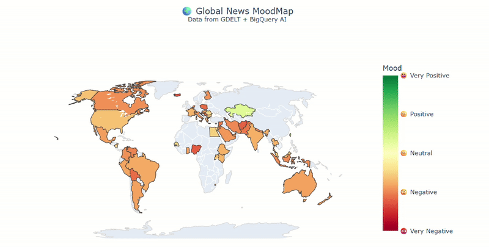

# 🌍 Global News MoodMap with BigQuery AI  

Turn the overwhelming flood of global news into an **interactive world sentiment dashboard**.  
This project was built for the **BigQuery AI Hackathon 2025** and showcases how to combine **BigQuery + Generative AI + Vector Search** into a single workflow.  

---

## 📌 Project Overview  
Global news streams are massive, fragmented, and hard to interpret.  
The **Global News MoodMap** solves this by:  
- **Summarizing** daily news per country with LLMs.  
- **Scoring sentiment** with a blend of GDELT tone + AI analysis.  
- **Finding historical analogs** via vector search.  
- **Visualizing mood** on an interactive choropleth map.  

👉 In one click, decision-makers can see **what happened, why it matters, and how sentiment is shifting worldwide.**  

---

## 🛠️ Workflow  

The pipeline is split into modular scripts:  

- **`gcp_utils.py`** → init Vertex AI + BigQuery.  
- **`ingestion.py`** → ingest + enrich GDELT events.  
- **`processing.py`** → build daily country topics, embeddings, vector search fns, top entities.  
- **`analytics.py`** → analog search, briefings, sentiment scoring.  
- **`visualization.py`** → interactive MoodMap with Plotly.  
- **`pipeline.py`** → main entrypoint orchestrating all steps.  

### Dataflow  

1. **Ingest GDELT data**  
   - `gdelt_events_raw`: GDELT 2.0 events (60 days).  
   - `gdelt_events_enriched`: joined with GKG → adds themes, people, orgs.  

2. **Aggregate daily country docs**  
   - `daily_country_topics`: one row per `(country, day)` with headline count, tone, top events, and a compact `topic_doc`.  

3. **Semantic embeddings + search**  
   - `news_embeddings`: Gemini embeddings for each topic doc.  
   - `fn_similar_to_text(query)` → search by meaning.  
   - `fn_similar_to_day(country, day)` → retrieve historical analogs.  

4. **AI-generated briefings**  
   - `daily_briefings`: structured summaries with 4 sections: *What happened, Key drivers, Impact, Watch next*.  
   - Enriched with **historical analogs**.  

5. **Mood scoring + visualization**  
   - `daily_moodmap`: combines AI sentiment + GDELT tone.  
   - Interactive **Plotly choropleth** with hover summaries.  

---

## 📊 Demo  

  

[🎥 Watch full demo video](https://vimeo.com/1118333984?share=copy)  

---

## ⚖️ Notes  
- For cost efficiency, AI briefings + moodmap were generated only for the **latest day (top N countries)**.  
- Pipeline generalizes to multiple days with the same queries.  
- This was my **first hands-on project with BigQuery AI** → the goal was to learn fast while building something impactful.  

---

## 📌 Next Steps  
1. Extend to 14–30 days → richer temporal trends.  
2. Scrape article URLs → enrich summaries with snippets.  
3. Add regional & sector views.  
4. Real-time dashboard (Streamlit / Looker).  
5. Automated alerts for sharp sentiment shifts.  
